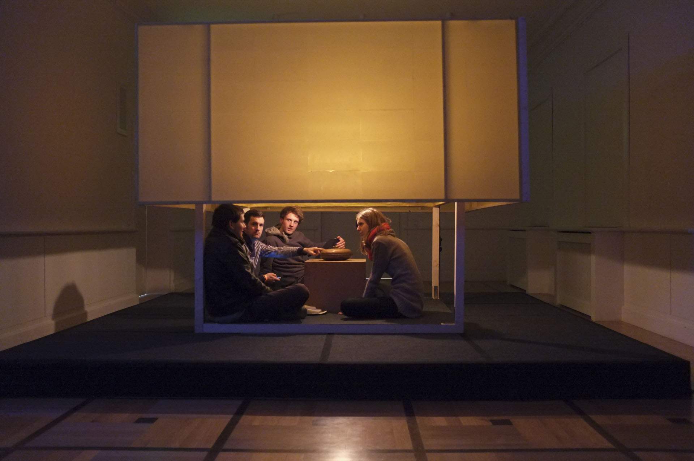
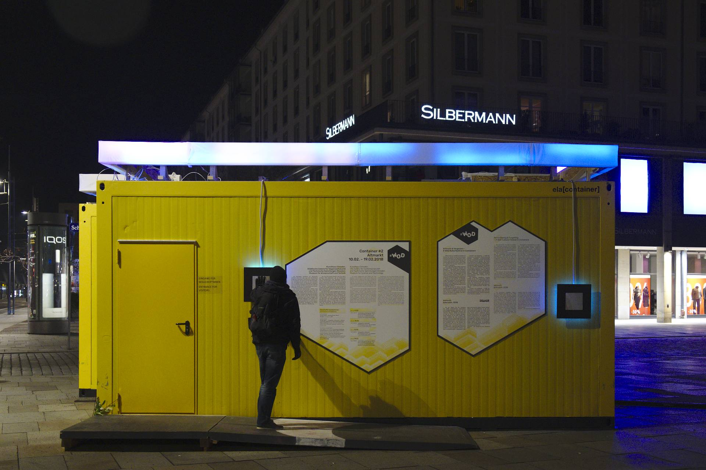

<!-- .slide: data-background-iframe=" assets/kazoosh/start/index.html" data-background-interactive -->

Note:
- entwickeln mit viel Freude interaktive Installationen
- Interaktion mit Publikum steht im Mittelpunkt -> etwas präsentieren,zeigen, zum entdecken einladen
- Freizeitformat
- offene Plattform
- interdisziplinär, hierarchielos

---

## Offenes Kollektiv 

<!-- .slide: data-background-iframe=" assets/kazoosh/mitglieder/index.html" data-background-interactive -->

Note:
- Wer macht das alles
- offenes Kollektiv
- jede/r macht mit wie er will
- kommt mal für ein Projekt oder ist dauerhaft dabei
- begonnen 2010 als Ferienprojekt von drei Medieninformatikern
- von Projekt zu Projekt andere Personen dazu, aus verschiedenen Fachbereichen/Interessen

---

## Interaktive Installationen - zwischen Kunst und Spiel

HEAT

	
koloroton

	
PONG

Note:
- zwischen Spiel und Kunst
- Fokus: Publikum wird eingeladen Werke zu erkunden
- zwischen Kunst und Spiel (links nach rechts)
- wechselnde Fachrichtungen je Projekt -> Ergebnisse variieren

- alle Installationen haben gestalterische und technische Aspekte
- beide in Kombination mit dem Ausstellungsort und Publikum erzeugen das Erlebnis
- Personen bei denen Ergebnis mehr im Fokus steht (icfh), andere der Prozess (Johannes)
  

---

## Interaktive Installationen - groß und klein

<!-- .slide: data-background="assets/kazoosh/img/tetris.jpg"" data-background-interactive -->

Note:

- von groß bis klein
- Tetris2 
  - Interaktive Installation zum Hechtfest
  - "Tetris invers" -> Turm bauen mit Physik
  - Controller ein Stück Holz
  - wenn Möglichkeit uns zu präsentieren -> Gesamterscheinung wichtig
  - zum Hechtfest: Deko-Team, Shot-Bar, Sitzecke
- NES 
  - Gegenteil von Tetris, nicht inhaltlich aber im Format
- Großenbandbreite der Installationen
  

---

## Interaktive Installationen - Überblick

<!-- .slide: data-background-iframe=" assets/kazoosh/projekte/index.html" data-background-interactive -->

Note:
- jedes Jahr ein bis zwei Projekte
- früher Blockveranstaltung (1-2 Wochen) intensive Arbeit, viel Fokus auf Prozess
- heute längerer Zeitrum, weniger intensiv, Fokus viel auf Ergebnis
- früher einzigartige Ortsbezogene Installationen
- heute Wiederverwendbarkeit
- zu Anfang viele konzeptuell sehr starke Arbeiten -> Künstler
- in den letzten Jahre viel spielerisches 
- Ergebnis hängt von den Leuten ab
- Koloroton viele Externe, Zeitproblem

---

## Projekte - musicismyradar

<!-- .slide: data-background="assets/kazoosh/img/mimr2.jpg" data-background-size="cover" -->

Note:
- Musikinstallation, Künstlerisch -> Personen unabhängig vom musikalischen Vorwissen miteinander musizieren/jammen
- einsteigerfreundlich -> schon reglementiert in Interaktionsmöglichkeiten
- trotzdem genügend Möglichkeiten um auch zu improvisieren
- deshalb elektronische Musik -> regelbasiert, einzelne Tracks, können mit Filtern und Parametern manipuliert werden
- 8 Instrumente aus Teilen vom Schrott, die von der Anmutung her schon zu Interaktionen auffordern (Fleischwolf)
- Instrument = Midi-Controller, Manipulation eines vorgefertigten Tracks
- Tritt auf Matte, Track beginnt, Interaktion manipuliert Track
- externe Musiker produzierten Tracks 

---

## Projekte - musicismyradar
<!-- .slide: data-background-video="assets/kazoosh/img/music_is_my_radar.webm" data-background-size="contain" data-background-interactive -->

---

## Projekte - Omi Cup

<!-- .slide: data-background="assets/kazoosh/img/omicup.JPG"" data-background-interactive -->

Note:
- spielerisch
- Konzept zur BRN
- gegeneinander auf Hometrainern fahren
- dabei in die Röhre starren
- Ferngesteuerte Rentner-Mobile mit Kamera (Line-Follower)
- fahren durch die Neustadt (Hecht, Prohlis..)
- niederschwellig, Tansportabel außer Platte
- Mitmachfaktor durch Kulissen -> Gestaltung wieder wichtiger Punkt

---
## Projekte - Omi Cup
<!-- .slide: data-background-video="assets/kazoosh/img/omicup_2019.mp4" data-background-size="contain" data-background-interactive -->

---

## Projekte - Solarbird

<!-- .slide: data-background="assets/kazoosh/img/solarbird.jpg"" data-background-interactive -->

Note:
- Coronazeit, kein Treffen möglich, keine Festivals
- etwas K! nach hause holen
- Johannes Interesse an autarken elektronischen Wesen
- inspiriert von Motorbörd/Solarbird Kazoosh eigene Interpretation
- Anspruch: autarkes Wesen, realistische Vogelsounds, wenige Komponenten, gestalterisch anprechendes Vogelkleid 

---
## Projekte - Solarbird
<!-- .slide: data-background-video="assets/kazoosh/img/solarbird_promo.mp4" data-background-size="contain" data-background-interactive -->

---

## Wie gehts weiter?

- Vorträge zum Solarbird
- selbst einen Vogel basteln
- uns an einem Mittwoch besuchen (ab 20:45, alte Fabrik)
- bei einem Projekt mitmachen
- kazoosh.com
