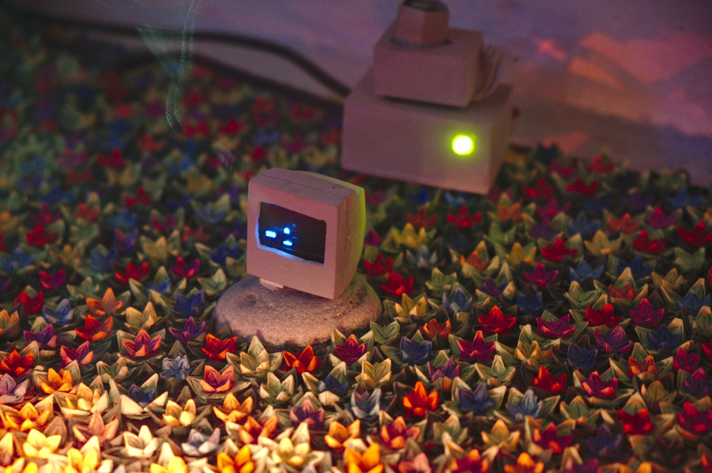
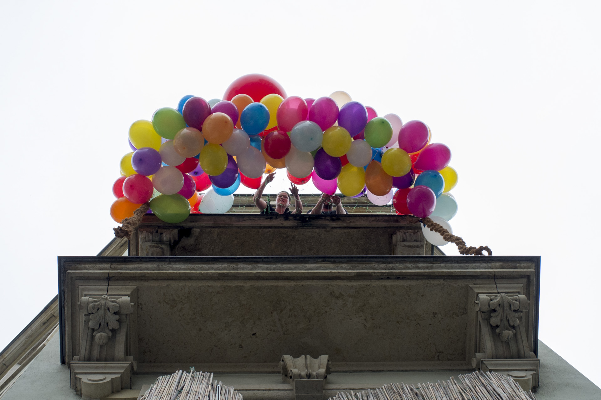
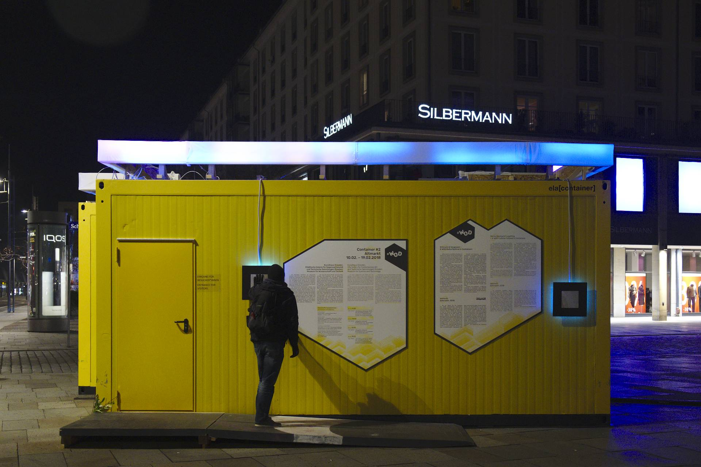

# SOLARBIRD ELECTRTONICS
<!-- .slide: data-background="assets/electronics/v1.jpg"" data-background-interactive -->
---

## JOHANNES FRITZSCHE
- bei Kazoosh! seit 2011

- 1985 bis 1990 ZMD Messtechnik (Wafer, U61000)
- 1992 bis 1994 Lehre Kommunikationselektroniker bei Rohde und Schwarz
- 1994 bis 1995 Neumann und Müller Veranstaltungstechnik
- 1995 bis 2004 SAEK Hörfunkstudio (Evosonic, Neon425, Apparillo)
- 2004 bis heute EBD gGmbH FKA
- 1Sohn Conrad *1999

---

## SOLARBIRD ODER FLIMMERFEEN 4.0
- ein Stichpunkt
- noch ein Stichpunkt
- mit "o" sieht man alle Folien in der Übersicht
- mit "s" sieht man Notizen in einem extra Fenster
- weiter mit Mausrad, Pfeiltasten oder Klick auf versteckten Button rechts unten ;)

Note:
- hier kann man sich Notizen notieren
- mit "s" kann man Sie in einem extra Fenster anschauen
- die Folie wird mit "---" beendet, siehe Zeile drunter

---

## Hintergrundbild
<!-- .slide: data-background="assets/sample_presentation/bg.jpg"" data-background-interactive -->

* Ein schönes Hintergrundbild mit unnötigem Text davor

---

## Bilder nebeneinander

					
					
					

---

## Video
<!-- .slide: data-background-video="assets/sample_presentation/video.webm" data-background-size="contain" data-background-interactive -->

---

## Lokaler Iframe
<!-- .slide: data-background-iframe=" assets/sample_presentation/Iframe/index.html" data-background-interactive -->

---

## Externer Iframe
<!-- .slide: data-background-iframe=" 25mmhg.net" data-background-interactive -->

