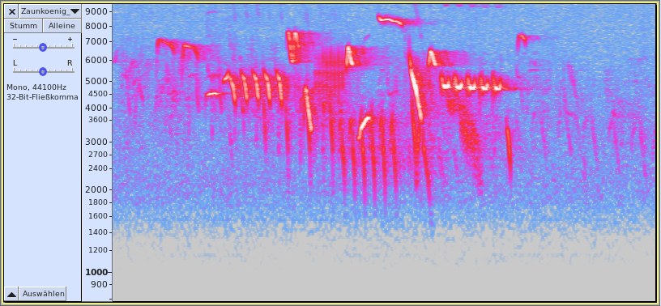

# Sound to the Bird

• Möglichkeiten der Hardware zur Klangerzeugung

• Erzeugung von authentischen Vogelstimmen


---

## Hardware zur Klangerzeugung

Piezo-Wandler

ATtiny85V  
• 8-bit AVR-Prozessor mit 8 MHz Taktrate  
• 512 Byte RAM  
• **8 KB Flash** ↯

Zu wenig Speicher für Audio-Samples:  
8-bit, 24 kHz, mono benötigt immer noch 24 KB/s


---

## Wie ist eine Vogelstimme aufgebaut?



Charakteristika:  
• Einzeltöne im Bereich 2-10 kHz  
• gleitende Tonhöhe (Chirp)  
• wiederholende Muster


---

## Umsetzung im Code

```
void static chirp( unsigned long tonePeriodStart, unsigned long tonePeriodEnd, unsigned long tonePeriodStep, unsigned int tonePeriodStepInterval=4, bool disableInterrupts=true )
{
	unsigned long tonePeriod = tonePeriodStart;
	unsigned int halfCycle = 0;

	if ( disableInterrupts ) { noInterrupts(); }

	// up
	if ( tonePeriodStart > tonePeriodEnd )
	{
		while ( tonePeriod > tonePeriodEnd )
		{
			halfCycle++;
			Piezo::toggle();
			delayMicroseconds( tonePeriod/2 );
			if ( halfCycle == tonePeriodStepInterval ) {
				tonePeriod -= tonePeriodStep;
				halfCycle = 0;
			}
		}
	}
	// down
	else
	{
		while ( tonePeriod < tonePeriodEnd )
		{
			halfCycle++;
			Piezo::toggle();
			delayMicroseconds( tonePeriod/2 );
			if ( halfCycle == tonePeriodStepInterval ) {
				tonePeriod += tonePeriodStep;
				halfCycle = 0;
			}
		}
	}

	if ( disableInterrupts ) { interrupts(); }
}
```

```
Piezo::on();
Piezo::chirp( 1E6/6700, 1E6/7200, 1, 20 );
Piezo::chirp( 1E6/7200, 1E6/6700, 1, 60 );
Piezo::chirp( 1E6/6700, 1E6/6400, 1, 20 );
Piezo::off();
delay( 50 );
Piezo::on();
Piezo::chirp( 1E6/6400, 1E6/6900, 1, 20 );
Piezo::chirp( 1E6/6900, 1E6/6400, 1, 60 );
Piezo::chirp( 1E6/6400, 1E6/6100, 1, 20 );
Piezo::off();
delay( 65 );
Piezo::on();
Piezo::tone( 1E6/4500, 1E6*0.070 );
Piezo::off();
delay( 40 );
Piezo::chirp( 1E6/5100, 1E6/5300, 1 );
for ( int i = 0; i < 5; i++ ) {
	Piezo::on();
	Piezo::chirp( 1E6/5300, 1E6/4300, 1, 4 );
	Piezo::off();
	delay( 55 );
}
```
